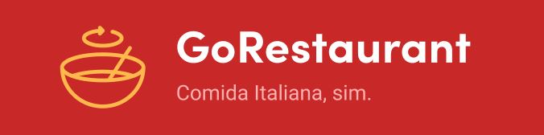
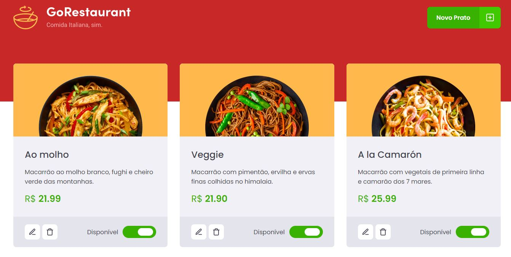
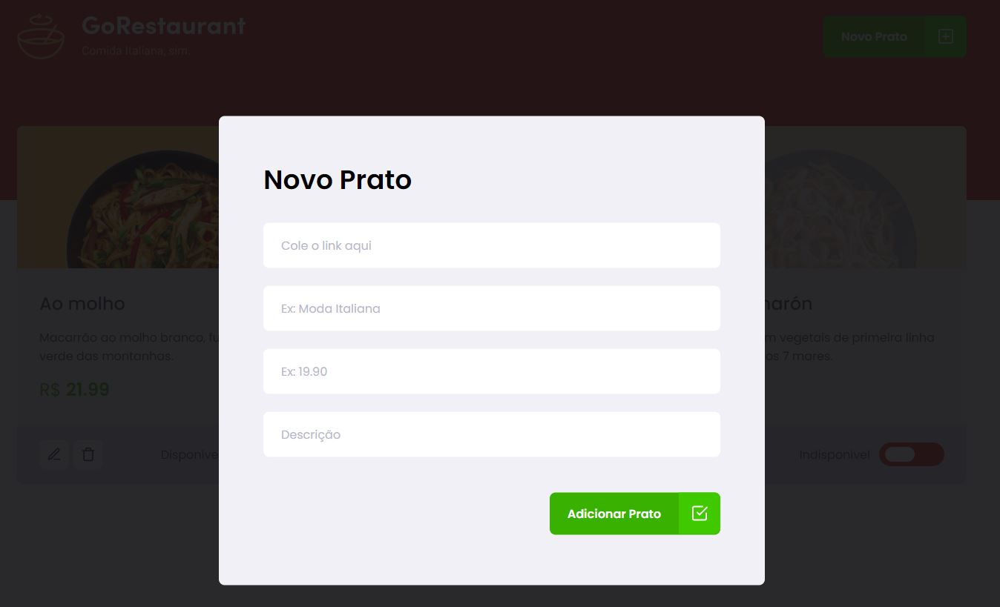

<p align="center">
   
</p>

# :page_with_curl: Table of Contents

* [About](#information_source-about)
* [Technologies](#computer-technologies)
* [Requirements](#page_with_curl-requirements)
* [Features](#rocket-features)
* [Images](#camera-images)
* [How to run](#seedling-how-to-run)
* [License](#pencil-license)

# :information_source: About

Go Restaurant is a web application for registering food. It was created as a challenge for the GoStack bootcamp, to practice knowledge in ReactJS.

# :computer: Technologies

- [ReactJS](https://pt-br.reactjs.org/)
- [TypeScript](https://www.typescriptlang.org/)

# :page_with_curl: Requirements

- [Node.js](https://nodejs.org/)
- [Yarn](https://yarnpkg.com/) (optional)
- [Git](https://git-scm.com/) (to clone the repository)

# :rocket: Features

- Add foods
- Delete foods
- Edit foods
- Mark food as available or unavailable

# :camera: Images

 
 
 
# :seedling: How to run

```bash
# Clone the repository
$ git clone https://github.com/lucas-almeida-silva/gorestaurant-web.git

# Go to the project folder
$ cd gorestaurant-web

# Install Dependencies
$ yarn
# or npm install

# Run the application
$ yarn dev
# or npm run dev
```
Access the application at http://localhost:3000

# :pencil: License

This project is under the [MIT license](LICENSE).
